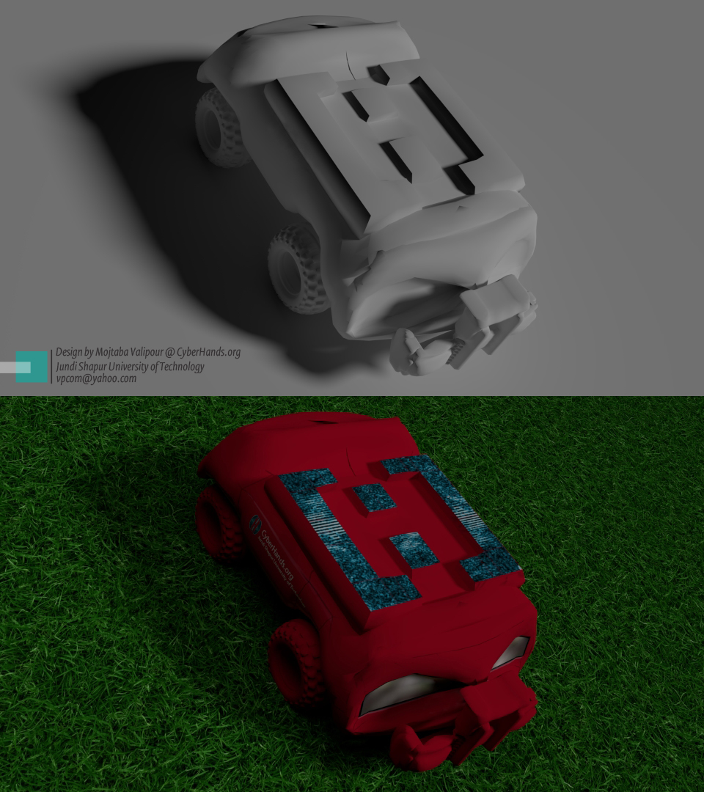
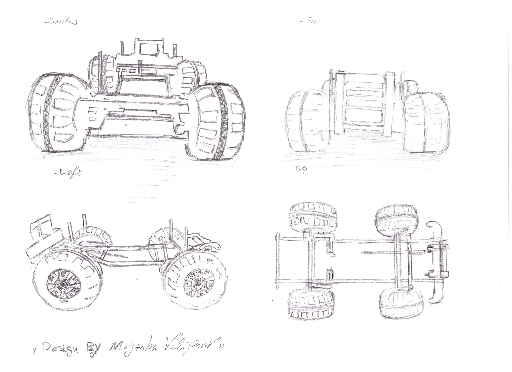
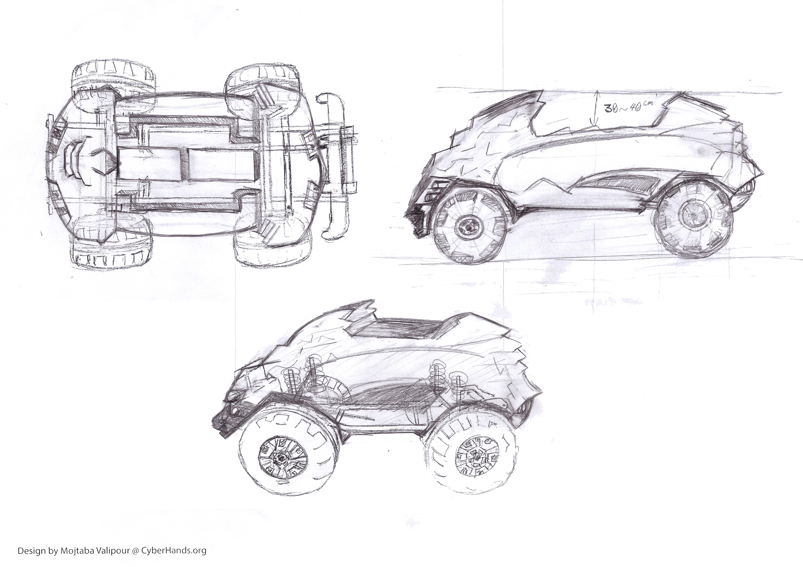
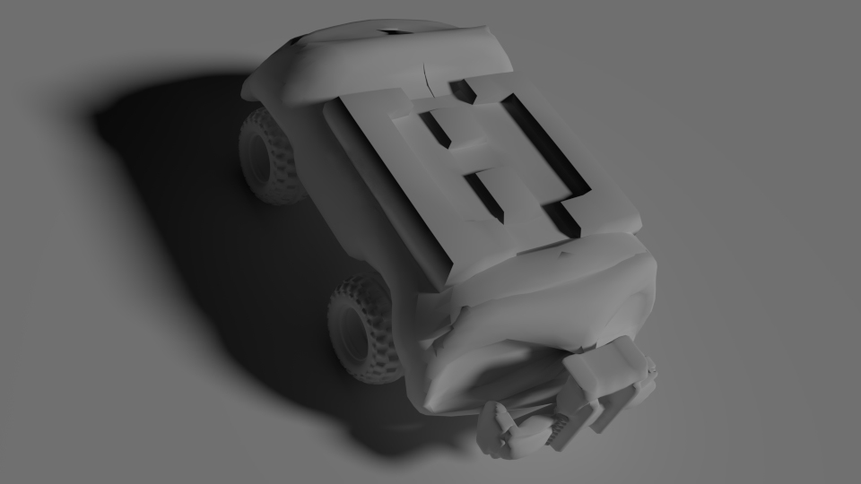
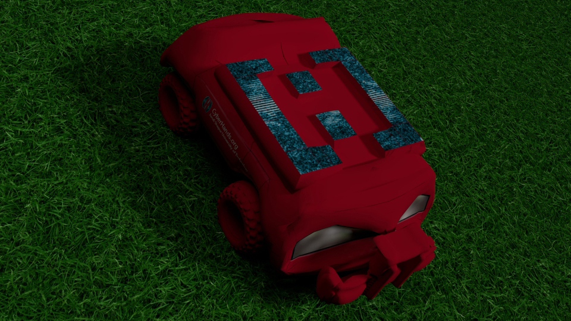
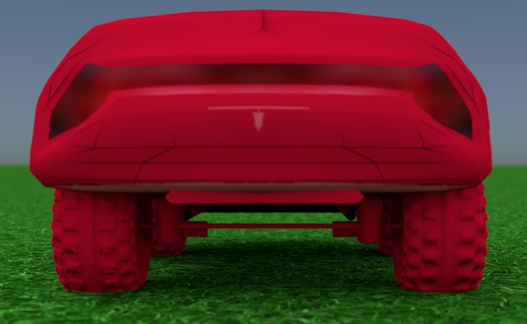
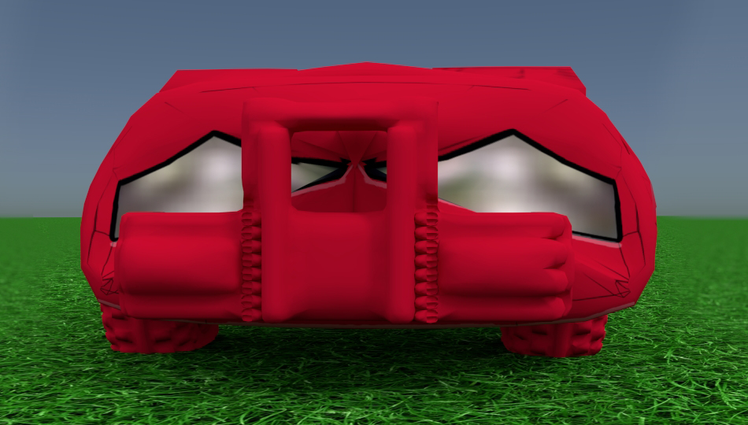
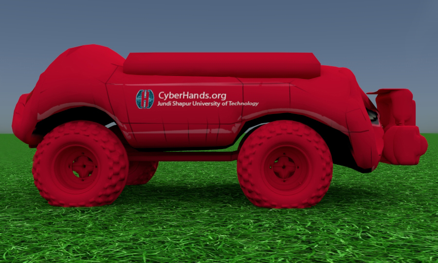
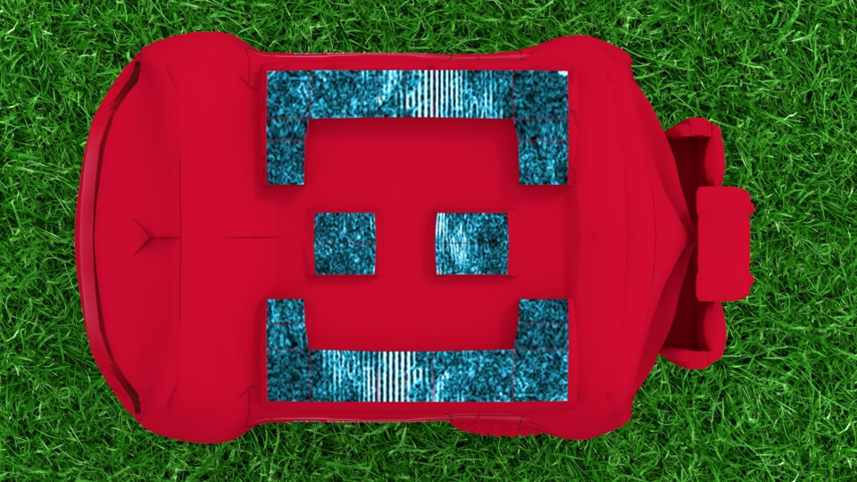

## TODO:
  * More detail here about the project

## CyberHands Faraz
This is the project repo for a novel design Unmanned Ground Vehicle based on [ROS](http://www.ros.org/).
  
## Parts:
 * 3D-Model: Blender 3d model and textures for the CyberHands Faraz
 * Design: Paper based design
 * ROS: Source code of the all parts of system
 * Thesis: The file of thesis in persian language
 * Videos: some screenshots of the original video files to demenstrate ability of the system



## Requirements:
  * Ubuntu 14.04
  * [ROS Indigo](http://wiki.ros.org/indigo/Installation/Ubuntu)
  
## Instructions:
1. Clone the project repository
```bash
git clone https://github.com/mvpcom/CyberHandsFaraz.git
```

2. Install dependencies

3. Source and Run the launch file
```bash
source chugv_ws/devel/setup.bash
roslaunch chugv_navigation chugv_navigation_gmapping.launch
```

## Demo:
[](https://www.youtube.com/watch?v=64ta-ivsetQ "Part1")
[](https://www.youtube.com/watch?v=5BzKhZO45WU "Part2")
[](https://www.youtube.com/watch?v=Cc_p0X3Xnjc "Part3")

## Design:
  

## 3D-Modeling in Blender:
  
  
  

## Designer and Programmer:
Mojtaba Vàlipour
